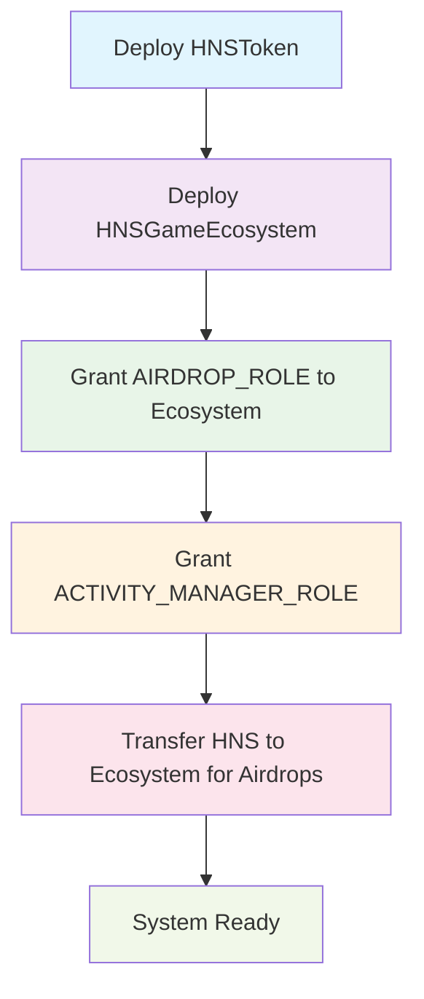
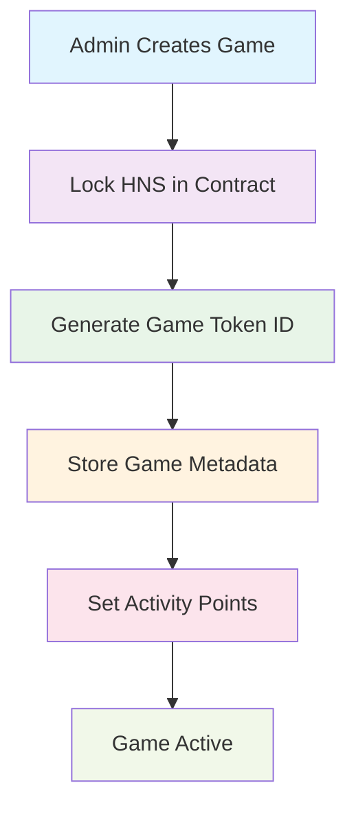
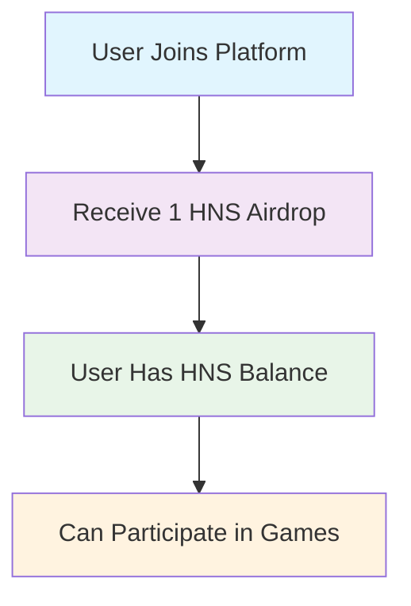
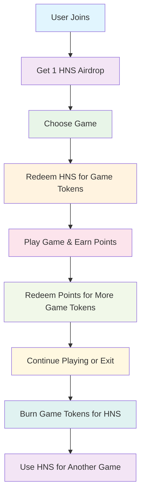

# HNS Gaming Ecosystem - Contract Flow & User Journey

## 🎯 **Overview**

The HashAndSlash (HNS) Gaming Ecosystem is a blockchain-powered gaming platform that enables users to participate in multiple games using a unified token system. The platform uses a 2-token architecture: **HNS (HashAndSlash)** as the core platform token and **Game Tokens** as game-specific tokens managed through ERC-1155.

---

## 🏗️ **Contract Architecture**

### **Smart Contracts**

```
┌─────────────────┐    ┌──────────────────┐    ┌─────────────────┐
│   HNSToken      │───▶│  HNSGameEcosystem│───▶│  Game Tokens    │
│    (ERC-20)     │    │   (ERC-1155)     │    │  (Token IDs)    │
└─────────────────┘    └──────────────────┘    └─────────────────┘
                              │
                              ▼
                       ┌──────────────────┐
                       │  Activity Points │
                       │   System         │
                       └──────────────────┘
```

### **Contract Details**

| Contract | Purpose | Standard | Key Features |
|----------|---------|----------|--------------|
| **HNSToken** | Core platform token | ERC-20 | Airdrop system, minting, role-based access |
| **HNSGameEcosystem** | Main ecosystem contract | ERC-1155 | Game creation, activity tracking, token conversion |
| **Game Tokens** | Game-specific tokens | ERC-1155 IDs | Individual game tokens with metadata |

---

## 🔄 **Contract Flow**

### **1. Initial Setup Flow**



**Steps:**
1. **Deploy HNSToken**: Create the core platform token with 1 billion supply
2. **Deploy HNSGameEcosystem**: Create the main ecosystem contract
3. **Setup Roles**: Grant necessary permissions to ecosystem and activity managers
4. **Fund Ecosystem**: Transfer HNS to ecosystem for airdrops and operations
5. **System Ready**: Platform is ready for user onboarding

### **2. Game Creation Flow**



**Steps:**
1. **Admin Action**: Admin calls `createGameToken()` with HNS amount and game details
2. **HNS Locking**: HNS tokens are locked in the contract for this game
3. **Token Creation**: New ERC-1155 token ID is generated for the game
4. **Metadata Storage**: Game name, symbol, and configuration are stored
5. **Activity Setup**: Admin configures activity points for different game actions
6. **Game Active**: Game is now available for user participation

### **3. User Onboarding Flow**



**Steps:**
1. **User Registration**: User connects wallet to platform
2. **Airdrop Check**: System checks if user has received airdrop
3. **Airdrop Execution**: If not received, 1 HNS is airdropped to user
4. **Balance Update**: User now has HNS to participate in games

---

## 🎮 **User Journey**

### **Complete User Flow**



### **Detailed User Journey**

#### **Phase 1: User Onboarding**
```solidity
// User receives airdrop
function airdropHNS(address user) external onlyRole(AIRDROP_ROLE)
```

**What Happens:**
- User connects wallet to platform
- System checks if user has received airdrop
- If not, 1 HNS is transferred to user
- User's airdrop status is marked as received

**User Experience:**
- User sees "Welcome! You received 1 HNS"
- User can now participate in games

#### **Phase 2: Game Selection & Entry**
```solidity
// User redeems HNS for game tokens
function redeemHNSForGameToken(uint256 gameId, uint256 hnsAmount) external
```

**What Happens:**
- User selects a game from available games
- User approves HNS spending for the ecosystem contract
- User calls `redeemHNSForGameToken()` with game ID and HNS amount
- HNS is transferred to contract
- Game tokens are minted to user based on HNS amount

**User Experience:**
- User sees list of available games
- User enters amount of HNS to convert
- User receives game tokens immediately
- User can now play the selected game

#### **Phase 3: Gameplay & Activity Tracking**
```solidity
// Activity manager records user actions
function recordActivity(uint256 gameId, address user, string action) external onlyRole(ACTIVITY_MANAGER_ROLE)
```

**What Happens:**
- User plays the game and performs actions
- Game backend calls `recordActivity()` for each user action
- Points are awarded based on configured activity values
- Activity logs are stored with timestamps

**User Experience:**
- User plays game normally
- Points are earned automatically for actions
- User can see points accumulating in real-time

#### **Phase 4: Points Redemption**
```solidity
// User redeems points for game tokens
function redeemPointsForGameToken(uint256 gameId, uint256 points) external
```

**What Happens:**
- User accumulates points through gameplay
- User calls `redeemPointsForGameToken()` with points to redeem
- Points are converted to game tokens (1:1 ratio)
- User's redeemed points are tracked

**User Experience:**
- User sees available points in dashboard
- User can redeem points for more game tokens
- User receives additional game tokens instantly

#### **Phase 5: Game Exit & Token Burning**
```solidity
// User burns game tokens for HNS return
function burnGameTokenForHNS(uint256 gameId, uint256 burnAmount) external
```

**What Happens:**
- User decides to exit the game
- User calls `burnGameTokenForHNS()` with amount to burn
- Game tokens are burned from user's balance
- HNS is returned to user based on proportional calculation
- User's game token balance is updated

**User Experience:**
- User can exit game at any time
- User receives HNS back proportional to burned tokens
- User can use HNS for other games or withdraw

---

## 📊 **Dashboard & Analytics**

### **User Dashboard Functions**

```solidity
// Get user balances
function getUserBalances(address user) external view returns (
    uint256 hnsBalance,
    uint256[] memory gameIds,
    uint256[] memory gameTokenBalances
)

// Get activity logs
function getActivityLogs(address user) external view returns (
    uint256[] memory gameIds,
    uint256[] memory totalPoints,
    uint256[] memory redeemedPoints
)

// Get detailed activity logs
function getDetailedActivityLogs(address user, uint256 gameId) external view returns (
    ActivityLog[] memory activities
)

// Get transaction logs
function getTransactionLogs(uint256 gameId, address user) external view returns (
    uint256 gameTokenBalance,
    uint256 totalPoints,
    uint256 redeemedPoints,
    uint256 availablePoints
)
```

### **Dashboard Features**

| Feature | Description | Data Source |
|---------|-------------|-------------|
| **HNS Balance** | Current HNS token balance | HNSToken contract |
| **Game Token Balances** | Balances for all games | HNSGameEcosystem ERC-1155 |
| **Activity Points** | Points earned per game | Activity tracking system |
| **Transaction History** | All token conversions | Event logs |
| **Game Performance** | Points earned vs redeemed | Activity analytics |

---

## 🔧 **Technical Implementation**

### **Key Functions by Contract**

#### **HNSToken Contract**
```solidity
// Core Functions
function airdropHNS(address user) external onlyRole(AIRDROP_ROLE)
function batchAirdropHNS(address[] calldata users) external onlyRole(AIRDROP_ROLE)
function mint(address to, uint256 amount) external onlyRole(MINTER_ROLE)

// View Functions
function hasUserReceivedAirdrop(address user) external view returns (bool)
function getAirdropStats() external view returns (uint256, uint256)
```

#### **HNSGameEcosystem Contract**
```solidity
// Game Management
function createGameToken(uint256 hnsAmount, string name, string symbol, uint8 decimals) external onlyRole(GAME_CREATOR_ROLE)
function getGameTokenInfo(uint256 gameId) external view returns (GameTokenInfo memory)
function getAllGameIds() external view returns (uint256[] memory)

// User Actions
function redeemHNSForGameToken(uint256 gameId, uint256 hnsAmount) external
function redeemPointsForGameToken(uint256 gameId, uint256 points) external
function burnGameTokenForHNS(uint256 gameId, uint256 burnAmount) external

// Activity System
function setActivityPoints(uint256 gameId, string action, uint256 points) external onlyRole(ACTIVITY_MANAGER_ROLE)
function recordActivity(uint256 gameId, address user, string action) external onlyRole(ACTIVITY_MANAGER_ROLE)

// Dashboard Functions
function getUserBalances(address user) external view returns (uint256, uint256[], uint256[])
function getActivityLogs(address user) external view returns (uint256[], uint256[], uint256[])
function getDetailedActivityLogs(address user, uint256 gameId) external view returns (ActivityLog[] memory)
function getTransactionLogs(uint256 gameId, address user) external view returns (uint256, uint256, uint256, uint256)

// Admin Functions
function pause() external onlyRole(PAUSER_ROLE)
function unpause() external onlyRole(PAUSER_ROLE)
function emergencyWithdraw(address token, address to, uint256 amount) external onlyRole(EMERGENCY_ROLE)
```

### **Data Structures**

#### **GameTokenInfo**
```solidity
struct GameTokenInfo {
    address creator;         // Game creator address
    string name;            // Game name
    string symbol;          // Game token symbol
    uint8 decimals;         // Token decimals
    uint256 initialSupply;  // Initial token supply
    uint256 hnsLocked;      // HNS locked for this game
    uint256 currentSupply;  // Current token supply
    bool active;            // Game status
    uint256 creationTime;   // Creation timestamp
}
```

#### **ActivityLog**
```solidity
struct ActivityLog {
    uint256 gameId;         // Game identifier
    string action;          // Action performed
    uint256 points;         // Points awarded
    uint256 timestamp;      // Activity timestamp
}
```

#### **UserActivity**
```solidity
struct UserActivity {
    uint256 totalPoints;    // Total points earned
    uint256 redeemedPoints; // Points redeemed for tokens
    ActivityLog[] activities; // Detailed activity history
}
```

---

## 🛡️ **Security & Access Control**

### **Role-Based Access Control**

| Role | Permissions | Assigned To |
|------|-------------|-------------|
| **DEFAULT_ADMIN_ROLE** | Full administrative control | Deployer |
| **GAME_CREATOR_ROLE** | Create new games | Admin |
| **ACTIVITY_MANAGER_ROLE** | Record user activities | Game backend |
| **AIRDROP_ROLE** | Perform airdrops | Ecosystem contract, Admin |
| **PAUSER_ROLE** | Pause/unpause operations | Admin |
| **EMERGENCY_ROLE** | Emergency withdrawals | Admin |

### **Security Features**

1. **Reentrancy Protection**: All external functions protected
2. **Input Validation**: Comprehensive validation for all inputs
3. **Access Control**: Role-based permissions for all sensitive operations
4. **Emergency Controls**: Pause functionality and emergency withdrawals
5. **Balance Checks**: All operations verify sufficient balances
6. **Custom Errors**: Gas-efficient error handling

---

## 📈 **Gas Optimization**

### **ERC-1155 Benefits**
- **Single Contract**: All game tokens managed in one contract
- **Gas Savings**: 93% reduction compared to separate ERC-20 deployments
- **Batch Operations**: Efficient batch transfers and queries
- **Metadata Management**: Unified metadata handling

### **Optimization Techniques**
- **Packed Structs**: Efficient storage layout
- **Custom Errors**: Gas-efficient error handling
- **Safe Math**: Overflow protection with minimal gas cost
- **Event Optimization**: Efficient event emission

---

## 🚀 **Deployment & Integration**

### **Deployment Steps**
1. Deploy HNSToken contract
2. Deploy HNSGameEcosystem contract
3. Grant necessary roles
4. Transfer initial HNS to ecosystem
5. Create initial games
6. Configure activity points

### **Integration Points**
- **Frontend**: Web3 integration for user interactions
- **Game Backend**: Activity recording and game management
- **Analytics**: Dashboard data aggregation
- **Wallet Integration**: MetaMask, WalletConnect support

---

## 📋 **Summary**

The HNS Gaming Ecosystem provides a **complete, secure, and efficient** gaming platform with:

✅ **2-Token Architecture**: HNS + Game Tokens (ERC-1155)  
✅ **Complete User Journey**: Airdrop → Game Entry → Play → Earn → Redeem → Exit  
✅ **Activity Points System**: Comprehensive points tracking and redemption  
✅ **Dashboard Functions**: Complete user analytics and balance tracking  
✅ **Security Features**: Multi-layered security with access controls  
✅ **Gas Optimization**: 93% gas savings through ERC-1155  
✅ **Admin Controls**: Full administrative and emergency controls  

The system is **production-ready** and provides a seamless gaming experience with transparent token economics and comprehensive user analytics.

---

*This documentation covers the complete contract flow and user journey for the HNS Gaming Ecosystem, providing developers and users with a comprehensive understanding of the platform's functionality and user experience.* 